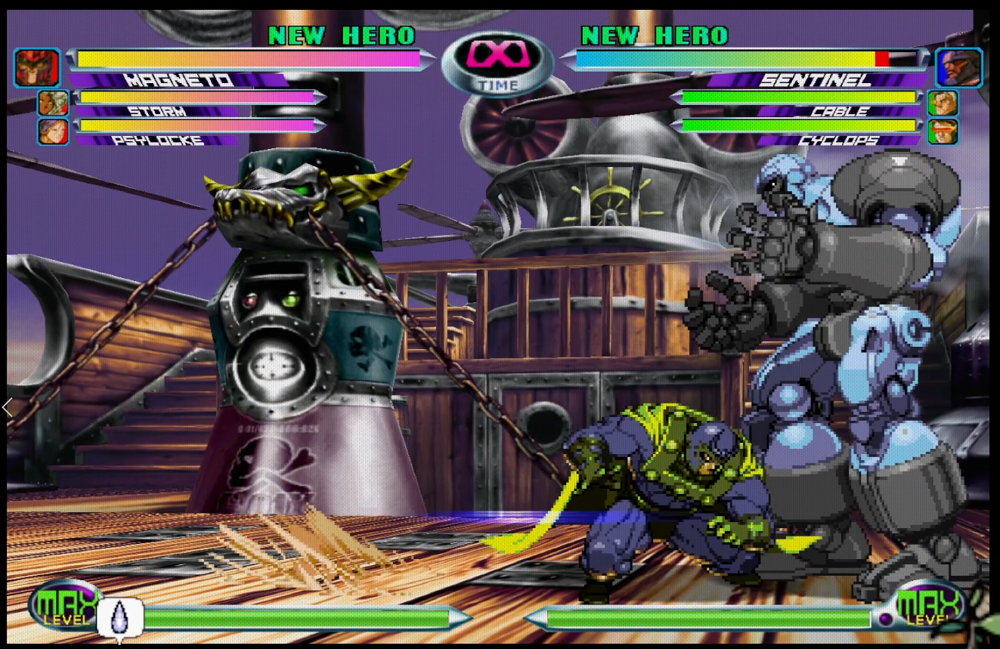
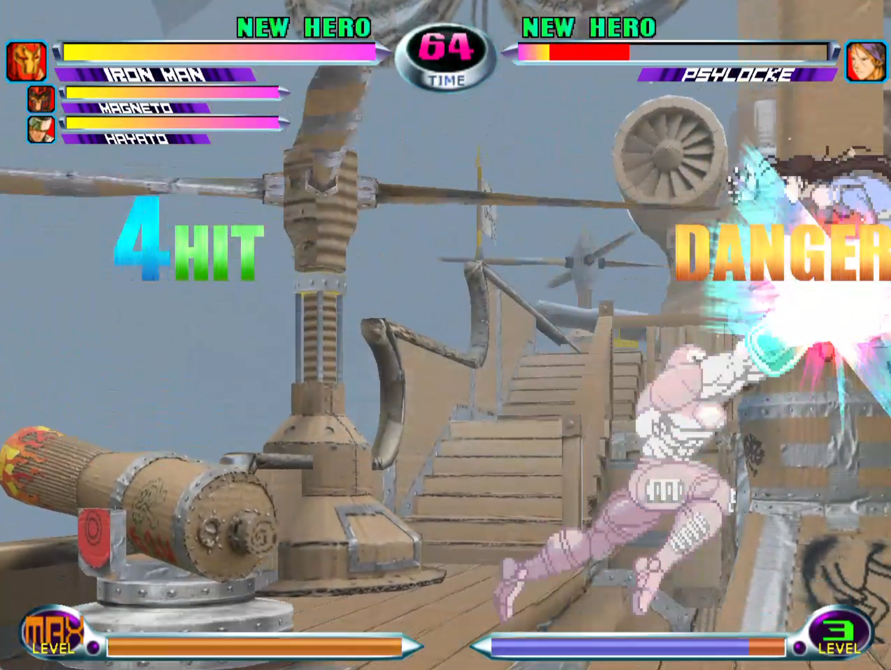
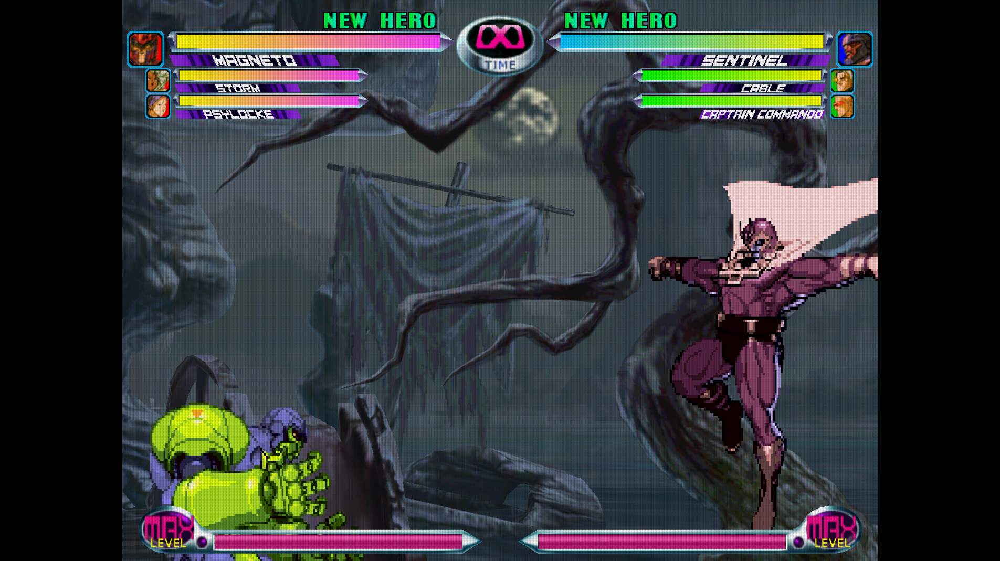
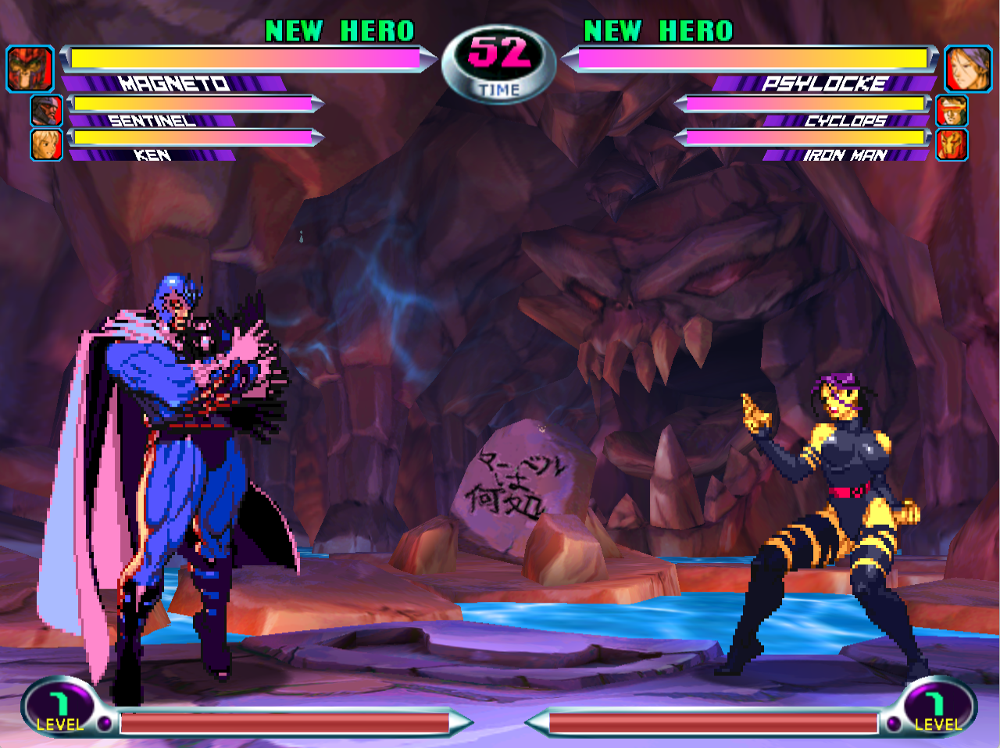
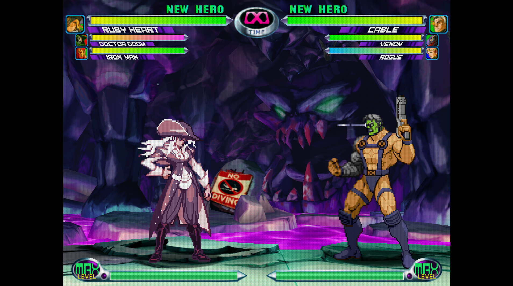
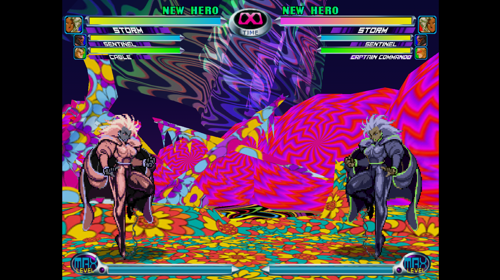
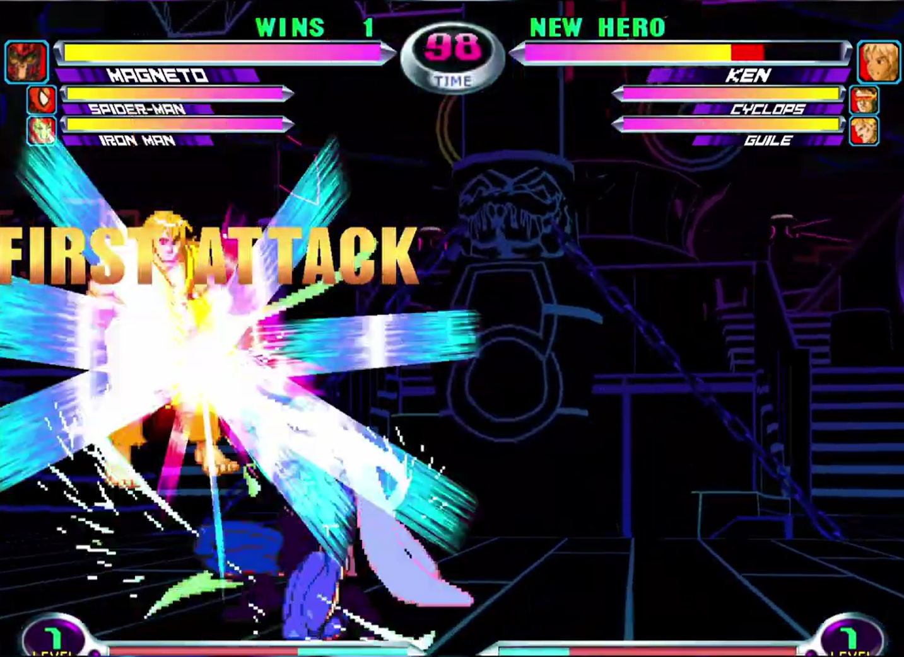
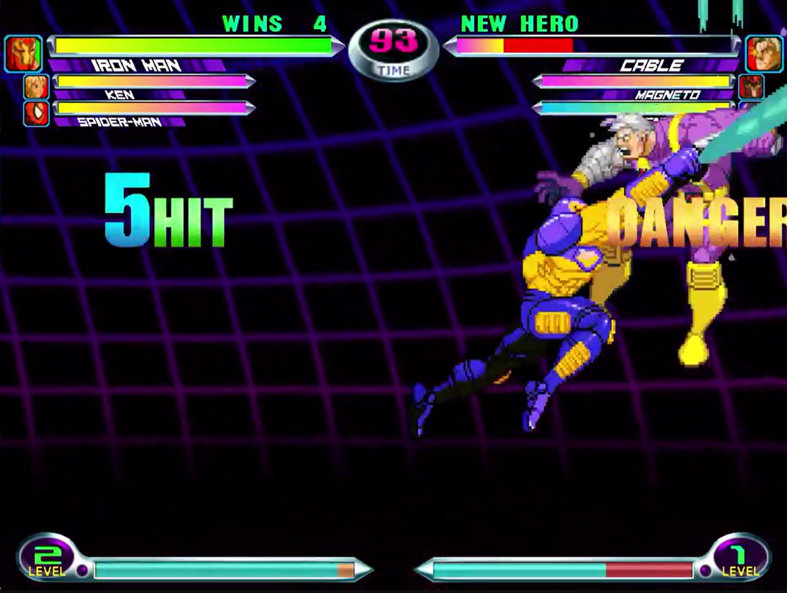
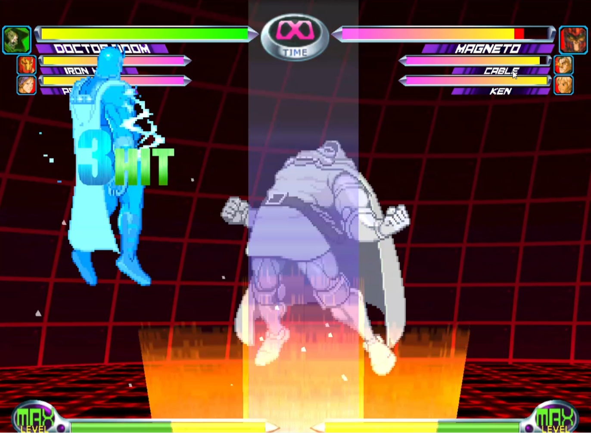

# MVC2 ModNao Patches

A temporary home for [ModNao](https://modnao.vercel.app) **Marvel vs. Capcom 2**  patches.

- [Patches](#patches)
- [How to Use These Patches](#how-to-use-these-patches)
- [Patch Your Game](#patch-your-game)
- [Contributing Patches](#contributing-patches)
- [Troubleshooting](#troubleshooting)

## Patches

| Preview | Patch | Files to load | Creator |
| --- | --- | --- | --- |
|  | **Airship (Sunset)** A warmer sunset version of the Airship Stage.  [Download patch](./stg00.sunset.mnp.zip) | `STG00POL.BIN` `STG00TEX.BIN` | herb |
|  | **Cardboard Flying Clubhouse** Airship rebuilt with cardboard, paper, TLC and some duct tape.  [Download patch](./stg00.cardboard.mnp.zip) | `STG00POL.BIN` `STG00TEX.BIN` | rob2d |
|  | **Moonlight Swamp Stage** An atmospheric moonlit variant of the Swamp Stage.  [Download patch](./stg04.moonlight.mnp.zip) | `STG04POL.BIN` `STG04TEX.BIN` | herb |
|  | **Coral Cave Stage** Coral-toned cave with bright blue water. The floating grave now says "Where's mahvel" in Japanese (made pre-MVCC)  [Download patch](./stg05.coral-cave.mnp.zip) | `STG05POL.BIN` `STG05TEX.BIN` | rob2d |
|  | **No Diving Stage** A darker cave flooded with neon water. Something seems to have happened that the sign is warning about.  [Download patch](./stg05.no-diving.mnp.zip) | `STG05POL.BIN` `STG05TEX.BIN` | herb |
|  | **LSD River Stage** The ice has melted... reality has too.  [Download patch](./stg07.lsd.mnp.zip) | `STG07POL.BIN` `STG07TEX.BIN` | herb |
|  | **Psychedelic Dark Airship Stage** Dark Airship stage with vivid neon colors.  [Download patch](./stg09.psychadelic-dark.mnp.zip) | `STG09POL.BIN` `STG09TEX.BIN` | rob2d |
|  | **Purple/Blue Dark Training Stage** Dark background with a purple and blue grid.  [Download patch](./stg0b.purple-blue-dark-training.mnp.zip) | `STG0BPOL.BIN` `STG0BTEX.BIN` | rob2d |
|  | **Red Tech Training Stage** Dark red grid with a glowing orange platform.  [Download patch](./stg0b.red-tech.mnp.zip) | `STG0BPOL.BIN` `STG0BTEX.BIN` | rob2d |

## How to Use These Patches

You will need files extracted from your own copy of MVC2. Back them up before
you start.

1. Download a patch from the list below. Do not extract or rename the
  `.mnp.zip` file.
2. Find the patch's **Files to load** in the table.
3. Open [ModNao](https://modnao.vercel.app) and click **Import files**.
4. Select all of the listed files together.
5. Click **Import files** again and select the `.mnp.zip` patch **by itself**.
6. Click **Export Models** for a listed POL file and **Export Texture BIN** for
  a listed TEX file.
7. ModNao adds `.mn` to each exported filename. Remove `.mn`, replace the
   matching original files, then add them back to your game.

Example: rename `STG0BPOL.mn.BIN` back to `STG0BPOL.BIN` before replacing the
original.

### Patch Your Game

- For Dreamcast, follow the process listed in
  [ModNao](https://modnao.vercel.app).
- To modify MVCC: after patching, follow
  [Paxtez' MVCC Mod Manager tutorial](https://youtu.be/WP_ALj4g5K8).

## Contributing Patches

Pull requests with new patches are welcome! Include the `.mnp.zip` as exported by ModNao, an in-game PNG preview, and a matching row in the table above.

For stage patches, a matching SELSTG texture patch is also welcome if you have one.

**Please do not include copyrighted game files or unrelated third-party IP.
Include only the minimum files needed for the patch, preview, and table entry.**

## Troubleshooting

- **Patch will not import:** Load the listed original files first, then choose
  only the `.mnp.zip` file on the second import.
- **ModNao says the patch is for a different resource:** Make sure you loaded
  the exact original files listed for that patch.
- **The stage has the original textures or unexpected colors:** Export and replace every file listed
  under **Files to load**.

No game files are included. These patches only work with files extracted from
your own copy of MVC2.
